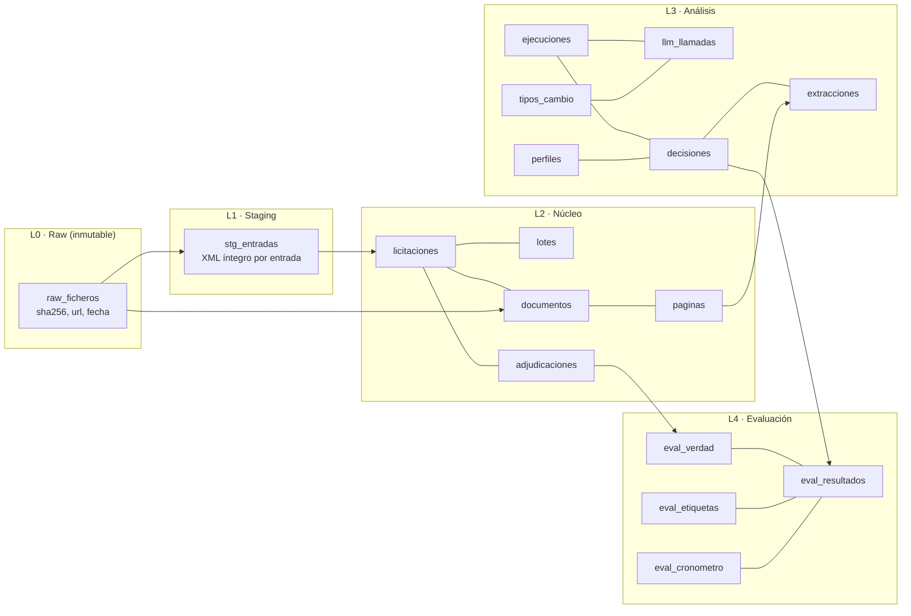

# DATOS — Trazabilidad de extremo a extremo

Objetivo: que cualquier línea del correo diario, y cualquier cifra del README, se pueda seguir hasta
el byte descargado del que sale, y en sentido contrario.

## 1. Principios

1. **Lo descargado no se toca.** Cada fichero (página del feed, pliego, tipo de cambio) se guarda tal
   cual, con su sha256. Nunca se sobrescribe ni se edita.
2. **Todo registro derivado apunta a su origen.** Cada fila de cada capa guarda el identificador de
   la fila de la que sale.
3. **Ninguna afirmación sin evidencia.** Cada requisito extraído lleva cita literal, documento y
   página, y se comprueba automáticamente que la cita está en esa página.
4. **Cada ejecución queda sellada:** commit de git, hash de la configuración, hash del perfil,
   modelos, versión de los prompts y de las reglas.
5. **Medir no vuelve a gastar.** Las respuestas del modelo se guardan íntegras. Las métricas se
   recalculan desde la base de datos sin llamar otra vez a la API.

## 2. Fuentes

| Fuente | Qué aporta | Formato | Acceso | Licencia / condiciones |
|---|---|---|---|---|
| Sindicación PLACSP 643 (perfiles alojados, sin menores): `contrataciondelsectorpublico.gob.es/sindicacion/sindicacion_643/licitacionesPerfilesContratanteCompleto3.atom` | Licitaciones, lotes, CPV, importes, plazos, enlaces a pliegos, solvencia en texto, adjudicatarios | Atom + CODICE (XML); páginas enlazadas con `rel="next"` | Público, sin clave. Verificado: 284 entradas y unos 7,8 MB por página | Reutilización de información del sector público; se cita la fuente |
| Ficheros zip históricos de PLACSP | Histórico desde 2012 | Zip de ficheros Atom | URL por confirmar en la Fase 1 (plan B: paginar el feed) | Ídem |
| Pliegos (PCAP, PPT, anexos) | Requisitos reales | PDF (con o sin texto), a veces zip o firmado | Enlaces `LegalDocumentReference`, `TechnicalDocumentReference` y `AdditionalDocumentReference` del feed | Documentos públicos |
| Tipo de cambio USD→EUR | Pasar el coste a euros | JSON | [api.frankfurter.app](https://api.frankfurter.app) (publica los tipos del BCE). 2026-09-18: 0,8726 | Público |
| Perfiles de empresa | Qué hace la empresa y su solvencia | Markdown según plantilla | Los escribes tú desde la web pública de cada empresa, con URL y fecha de consulta | Información pública |
| Etiquetas manuales y cronometrajes | M6 y M7 | Tablas | Generadas por ti, a ciegas | Propias |

Especificación del formato: [Formato de sindicación y reutilización](https://contrataciondelsectorpublico.gob.es/datosabiertos/especificacion-sindicacion.pdf)
y [Resumen de datos abiertos](https://contrataciondelsectorpublico.gob.es/datosabiertos/DGPE_PLACSP_ResumenDatosAbiertos.pdf).
Según ese resumen, la solvencia en el feed solo existe para los perfiles alojados en PLACSP, no para
los agregados. Algunos campos solo existen en licitaciones actualizadas después de 2018 o de 2021.

## 3. Capas

## 4. Tablas y a qué apuntan

### L0 · Raw
| Tabla | Campos clave | Apunta a |
|---|---|---|
| `raw_ficheros` | `id`, `tipo` (feed · pliego · anexo · tipo_cambio), `url`, `ruta_local`, `sha256`, `bytes`, `http_status`, `content_type`, `descargado_en` | `ejecucion_id` que lo descargó |

Ficheros físicos en `data/raw/<tipo>/<sha256[:2]>/<sha256>.<ext>`. La ruta depende del contenido:
el mismo fichero descargado dos veces ocupa un solo sitio.

### L1 · Staging
| Tabla | Campos clave | Apunta a |
|---|---|---|
| `stg_entradas` | `entry_id` (el `<id>` Atom), `entry_updated`, `posicion`, `xml` (íntegro), `estado_parseo` (ok · cuarentena), `error` | `raw_fichero_id` (página del feed) |

### L2 · Núcleo
| Tabla | Campos clave | Apunta a |
|---|---|---|
| `licitaciones` | `entry_id` + `entry_updated` (clave única: da la idempotencia), `expediente`, órgano (NIF, nombre), `objeto`, `tipo_contrato`, `cpv[]`, importes, `plazo_presentacion`, `estado` (PUB · EV · ADJ · RES · anulada), `solvencia_feed_texto` | `stg_entrada_id` |
| `lotes` | `numero`, `objeto`, `importe`, `cpv[]` | `licitacion_id` |
| `documentos` | `tipo` (PCAP · PPT · anexo), `url`, `estado_descarga`, `formato`, `paginas`, `con_capa_texto` | `licitacion_id`, `raw_fichero_id` |
| `paginas` | `numero`, `texto`, `metodo` (texto · ocr_modelo) | `documento_id`, `llm_llamada_id` si hubo OCR |
| `adjudicaciones` | `lote`, `adjudicatario_id` (NIF si es empresa; hash si es persona física), `nombre`, `es_pyme`, `es_ute`, `importe`, `fecha` | `licitacion_id`, `stg_entrada_id` |

Cada actualización de una entrada crea una versión nueva. La vista `v_licitaciones_vigentes` muestra
la última.

### L3 · Análisis
| Tabla | Campos clave | Apunta a |
|---|---|---|
| `ejecuciones` | `run_id`, `tipo` (diaria · histórica · evaluación), `n8n_execution_id`, `git_commit`, `config_sha256`, modelos, `presupuesto_eur`, inicio, fin, `estado`, `mensaje` | `perfil_id` |
| `perfiles` | `alias` (Empresa A…), `texto`, `sha256`, `fuentes` (URL + fecha), `cifra_negocio` + fuente, `rol` (desarrollo · test), `congelado_en` | — |
| `llm_llamadas` | `nodo`, `modelo`, `prompt_version`, `prompt_sha256`, `request_id` de Anthropic, tokens (entrada, salida, lectura de caché, escritura de caché), `batch`, `coste_usd`, `coste_eur`, `latencia_ms`, `stop_reason`, `respuesta` (íntegra) | `run_id`, `licitacion_id`, `tipo_cambio_fecha` |
| `extracciones` | `campo`, `valor`, `unidad`, `cita_literal`, `pagina`, `cita_verificada` | `documento_id`, `llm_llamada_id`, `run_id` |
| `decisiones` | `puntuacion_triaje`, `resultado` (descartada · apta · no_apta · revisar · pendiente), `motivo`, `reglas_version`, `ruta_grafo` (nodos recorridos) | `run_id`, `licitacion_id`, `perfil_id`, `extraccion_ids[]`, `thread_id` del checkpoint |
| `tipos_cambio` | `fecha`, `usd_eur` | `raw_fichero_id` (respuesta original) |
| Checkpoints de LangGraph | Estado completo tras cada nodo | `thread_id = run_id:licitacion_id` |

### L4 · Evaluación
| Tabla | Campos clave | Apunta a |
|---|---|---|
| `eval_verdad` | Contrato ganado por una empresa del estudio | `perfil_id`, `adjudicacion_id` |
| `eval_etiquetas` | `etiqueta`, `etiquetador`, `a_ciegas`, `fecha` | `licitacion_id`, `perfil_id` |
| `eval_cronometro` | `dia`, `modo` (manual · radar), `minutos`, `decisiones` | — |
| `eval_resultados` | `metrica`, `valor`, `ic_inferior`, `ic_superior`, `n`, `git_commit`, `comando` | `run_id` |
| `feedback_usuario` (Fase 7) | `decision` (me presento · no) | `licitacion_id`, `n8n_execution_id` |

## 5. Identificadores

| Objeto | Identificador | Por qué es estable |
|---|---|---|
| Licitación | `<id>` de la entrada Atom (URL de PLACSP) + `<updated>` como versión | Lo asigna la Plataforma y no cambia |
| Fichero descargado | sha256 del contenido | Si cambia un byte, es otro fichero |
| Ejecución | `run_id` (UUID) | Generado al empezar. n8n lo recibe y guarda su propio `execution.id`, lo que enlaza los dos sistemas |
| Llamada al modelo | id propio + `request_id` de Anthropic | Permite cuadrar el coste con la consola de Anthropic |
| Perfil | sha256 del texto congelado | Demuestra que no se tocó después de congelarlo |

## 6. Recorridos

### Inverso: del correo al byte

Ejemplo de línea del correo: *"Ayuntamiento de X · Mantenimiento de aplicaciones · No apta: exige un
volumen anual de negocios ≥ 1.200.000 € (PCAP, p. 14); tu perfil declara 800.000 €."*

| Paso | Tabla | Qué se obtiene |
|---|---|---|
| 1 | `decisiones` | Resultado, motivo, versión de las reglas, extracciones usadas |
| 2 | `extracciones` | 1.200.000 €, cita literal, documento, página 14, `cita_verificada = true` |
| 3 | `paginas` | Texto de la página 14 contra el que se verificó la cita |
| 4 | `documentos` → `raw_ficheros` | URL del PCAP, sha256, fecha y hora de descarga |
| 5 | `licitaciones` → `stg_entradas` → `raw_ficheros` | La entrada exacta del feed y la página Atom de la que salió |
| 6 | `llm_llamadas` | Modelo, versión del prompt, tokens, coste en €, respuesta íntegra |
| 7 | `ejecuciones` | Commit de git, ejecución de n8n, presupuesto |

Comando previsto: `uv run python -m radar.traza --decision <id>` imprime esta cadena completa.

### Directo: de una cifra del README a su origen

`README: "Recall a igual volumen: X % (IC 95 %: a–b)"` → fila de `eval_resultados` (con `run_id`,
commit y comando) → `decisiones` de ese run → `eval_verdad` → `adjudicaciones` → entrada del feed.

## 7. Datos personales

- **Contactos de los órganos de contratación** (nombre, correo, teléfono del funcionario): el parser
  no los guarda.
- **Adjudicatarios que son personas físicas** (autónomos): su NIF es un DNI. Se guarda como hash con
  sal (la sal está en `.env`), y el nombre no aparece en ninguna salida pública.
- **Empresas del estudio:** en todo lo público aparecen como Empresa A–E. La correspondencia con el
  nombre real vive en `data/privado/` (fuera de git).

## 8. Qué se guarda dónde

| Qué | Dónde | En git |
|---|---|---|
| Código, migraciones SQL, prompts, reglas, workflows de n8n | Repo | Sí |
| Manifiesto de ficheros descargados (url, sha256, bytes, fecha) | `data/manifiestos/*.csv` | Sí: permite volver a descargar y detectar cambios |
| Hash de los perfiles congelados | `perfiles_congelados.csv` | Sí |
| Ficheros raw, textos de perfiles, correspondencia de empresas | `data/` | No |
| Base de datos | Volumen de Docker + `pg_dump` al cerrar cada fase | No (copia privada) |
| Credenciales | `.env` y almacén cifrado de n8n | Nunca |

## 9. Datos de ejemplo

- `tests/fixtures/`: entradas **reales** del feed y pliegos reales (son públicos). No son inventados.
- Los casos de rotura (PDF truncado, XML roto) se fabrican **a partir de ficheros reales** y se
  nombran `roto_*.pdf` / `roto_*.xml`.
- `ejemplos/`: plantillas y un perfil de ejemplo con la cabecera `DATOS DE EJEMPLO — no usar en producción`.
- Un test falla si el paquete `radar/` contiene esa cabecera o lee de `ejemplos/`.

## 10. El coste también es un dato

`coste_usd = entrada × p_entrada + salida × p_salida + lectura_caché × p_lectura + escritura_caché × p_escritura`,
multiplicado por 0,5 si se usa la Batch API. Los precios salen de una tabla versionada con fecha
(`radar/precios.py`). `coste_eur = coste_usd × usd_eur` del día, y el tipo de cambio queda guardado
con su respuesta original. Cada euro del informe se descompone en tokens, tarifa y tipo de cambio.
