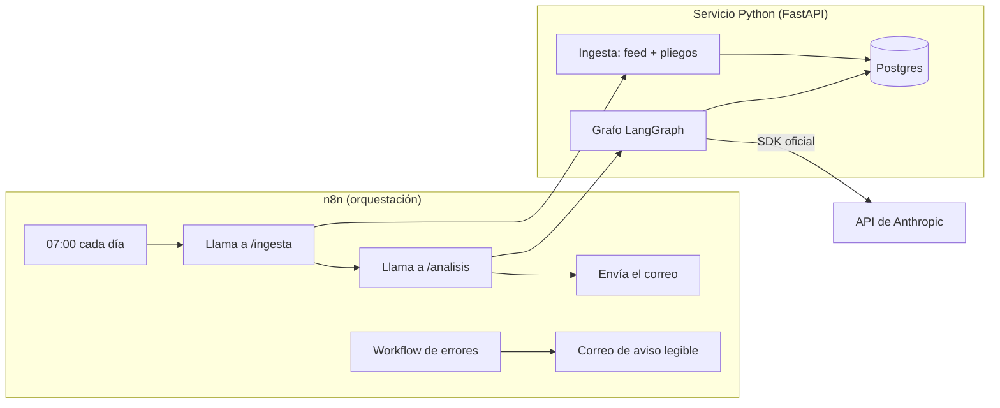
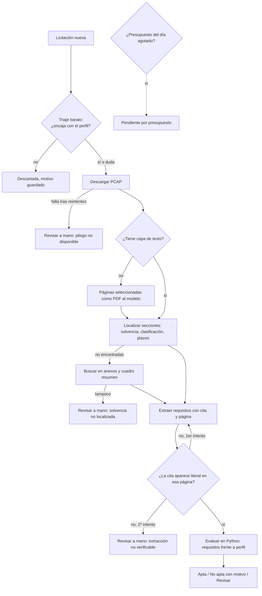

# SPEC — Radar de licitaciones que lee el pliego

Versión 1.0 · 2026-09-19 · Estado: aprobada para Fase 0

## 1. Tesis

> Las alertas de licitaciones deciden qué mirar por código CPV y palabras del título. Lo que dice si
> una empresa puede presentarse (solvencia, clasificación, lotes, plazos) está en el pliego. Un agente
> que lee el pliego encuentra más contratos adecuados que el filtro CPV, con una lista diaria del
> mismo tamaño.

**Cómo podría ser falsa** (y se publicaría igual):
- El filtro CPV recupera lo mismo o más con una lista igual de corta → leer el pliego no aporta.
- El feed estructurado ya trae la solvencia con cifras en la mayoría de casos → el pliego sobra.
- El agente descarta por solvencia contratos que la empresa acabó ganando → no es fiable.

**Evidencia previa** (una sola página del feed en vivo, 284 expedientes, descargada el
2026-09-19; no es una muestra representativa, la Fase 1 la sustituye por una medición):

| Dato | Valor |
|---|---|
| Expedientes con bloque de solvencia en el feed | 239 (84 %) |
| …de los cuales incluyen cifras (€, "veces") | 42 (18 % de esos 239) |
| …de los cuales remiten al pliego ("ver apartado G del cuadro resumen del PCAP") | 128 (54 %) |
| Expedientes con enlace al pliego administrativo (PCAP) | 274 (96 %) |
| Expedientes con adjudicatario identificado | 110 (39 %; son los que están en estado ADJ o RES) |
| Expedientes con lotes | 46 (16 %) |
| Expedientes con CPV 72 o 48 (servicios y software TI) | 12 (4 %) |

## 2. Usuario y proceso que sustituye

**Usuario:** la persona que decide si una pyme o consultora se presenta a un concurso (gerente,
responsable de licitaciones).

**Proceso actual:** cada mañana revisa las licitaciones nuevas (alertas por CPV de la propia
Plataforma o de un servicio de pago), abre las que parecen encajar, busca en el pliego la solvencia
exigida y los plazos, y decide si se presenta.

**Proceso con el radar:** recibe a las 07:00 un correo con una lista corta. Cada licitación trae
la decisión (apta / no apta / revisar), el motivo y la cita del pliego con número de página. Para
decidir, solo abre las que le interesan.

## 3. Alcance v1

| Dentro | Fuera (v1) |
|---|---|
| Licitaciones de perfiles alojados en PLACSP (sindicación 643), sin contratos menores | Plataformas autonómicas agregadas (sindicación 1044), que no traen la solvencia en el feed |
| Contratos de servicios y suministros | Obras, concesiones |
| Perfiles de empresa de servicios TI y consultoría | Otros sectores |
| Solvencia económica, solvencia técnica, clasificación, plazo e importe | Criterios de adjudicación y probabilidad de ganar |
| Castellano | Pliegos en catalán, euskera o gallego (se marcan como "revisar") |

## 4. Qué hace el sistema

Grafo del agente (cada flecha condicional es una rama real):

## 5. Métricas

| ID | Métrica | Definición | Verdad de referencia |
|---|---|---|---|
| M1 | **Recall a igual volumen** (principal) | % de contratos ganados por la empresa que aparecen en la lista corta, con la lista del agente recortada al mismo tamaño diario medio que la del filtro CPV | Adjudicatario (NIF) publicado en el feed |
| M2 | Volumen de la lista corta | Licitaciones por día en la lista, agente frente a filtro CPV | Conteo |
| M3 | Exclusiones erróneas por solvencia | % de contratos ganados que el agente marcó "no apta". Si la empresa ganó, cumplía la solvencia, así que cada caso es un error demostrado | Adjudicación + cifra de negocio pública de la empresa (si no existe, M3 se declara no medible) |
| M4 | Exactitud de extracción | Importe y plazo extraídos del pliego frente a los campos estructurados del feed | Campos `BudgetAmount` y `TenderSubmissionDeadlinePeriod` |
| M5 | Citas verificadas | % de extracciones cuya cita aparece literal en la página indicada | Texto de la página (comprobación automática) |
| M6 | Precisión | % de la lista corta que una persona considera adecuada, etiquetando a ciegas una mezcla de lo que marcan el agente y el filtro CPV | Etiquetado manual, n declarado |
| M7 | Trabajo evitado (automática) | Páginas del pliego que hay que leer por licitación, documentos que hay que abrir y saltos entre documentos (pliego → anexo → anuncio) | Los propios pliegos descargados; se cuenta con un script |
| M7b | Tiempo de revisión (opcional) | Minutos para decidir, a mano frente a con el radar | Cronómetro, 1 revisor. Solo se puede medir antes de la Fase 4; si no se hace, el README no dará ninguna cifra de minutos |
| M8 | Coste | € por licitación triada, por pliego leído y por día | `usage` de cada respuesta × tarifa × tipo de cambio del BCE |

## 6. Criterios de éxito (fijados antes de medir)

- **Tesis sostenida:** la diferencia de M1 (agente − filtro CPV) es positiva y su intervalo de
  confianza al 95 % (bootstrap pareado por contrato) excluye el 0.
- **Tesis refutada:** la diferencia es negativa y su intervalo excluye el 0.
- **No concluyente:** cualquier otro caso. Se publica como tal.
- **Fiabilidad mínima:** M3 ≤ 5 % y M5 ≥ 98 %. Si no se cumplen, el agente no está listo para uso
  real, con independencia de M1.
- **Coste:** el objetivo diario por perfil se fija al cerrar la Fase 1, con el volumen ya medido.
  El límite duro inicial es `PRESUPUESTO_DIARIO_EUR=2.00`.
- **Separación desarrollo/test:** las empresas de test no se miran hasta la Fase 5. El agente se
  ajusta solo con las empresas de desarrollo.

## 7. Innegociables y cómo se cumplen

| Innegociable | Mecanismo | Dónde se verifica |
|---|---|---|
| Medición real | `uv run python -m radar.evaluacion` recalcula M1–M8 desde los datos guardados | `eval_resultados` + informe de la Fase 5 |
| Nada ficticio | Fixtures reales del feed; ejemplos marcados y fuera de `radar/` | Test que falla si `radar/` contiene la cadena de ejemplo |
| Se puede romper | Matriz del §8, un test por fila | `tests/test_fallos.py` |
| Tests que fallan sin arreglo | Protocolo en `CLAUDE.md` | Historial de commits |
| Límites escritos | §9, que pasa al README | Revisión en la Fase 8 |
| Interfaz sobria | Correo y ficha HTML propios, sin plantillas | Revisión en la Fase 7 |
| Coste controlado | `radar/llm.py` con registro y presupuesto | `llm_llamadas` + test de presupuesto agotado |

## 8. Matriz de fallos

| Caso | Cómo se provoca en el test | Comportamiento esperado | Mensaje al usuario (borrador) |
|---|---|---|---|
| Sin red | Transporte httpx que lanza `ConnectError` | No se pierde nada; el cursor no avanza | "No hay conexión a internet. El informe de hoy no se ha generado; se reintentará en la próxima ejecución." |
| PLACSP caída o lenta | Respuestas 5xx, timeout, `ECONNRESET` | 3 reintentos con espera creciente; después, aviso | "La Plataforma de Contratación no responde desde las HH:MM. Hoy no hay datos nuevos." |
| Certificado TLS no verificable | Contexto TLS sin la raíz FNMT | Se detiene; nunca se desactiva la verificación | "No se ha podido verificar la identidad del servidor de la Plataforma. Revisa la instalación de certificados (certifi)." |
| Falta la clave de API | `.env` sin `ANTHROPIC_API_KEY` | Diagnóstico al arrancar; no se ejecuta nada | "Falta la clave de Anthropic en el fichero .env (ANTHROPIC_API_KEY)." |
| Clave inválida o sin saldo | Respuesta 401 / 403 | Se detiene y avisa | "La clave de Anthropic no es válida o la cuenta no tiene saldo." |
| Límite de uso o saturación | 429 / 529 | Reintentos del SDK; si persiste, la licitación queda "pendiente" | "N licitaciones quedan pendientes por saturación del servicio; se analizarán mañana." |
| Presupuesto agotado | Presupuesto de prueba de 0,01 € | No hay más lecturas a fondo; el resto queda "pendiente por presupuesto" | "Se ha alcanzado el presupuesto diario (2,00 €). N licitaciones quedan pendientes." |
| PDF corrupto o que no es PDF | Fichero truncado; página HTML de error | Esa licitación pasa a "revisar"; el resto continúa | "El pliego de <expediente> no se ha podido leer (fichero dañado)." |
| PDF escaneado | PDF sin capa de texto | Rama OCR sobre páginas seleccionadas | (sin mensaje: es un camino normal, queda registrado) |
| Pliego en zip o firmado (.xsig) | Fixture real | Extraer si es posible; si no, "revisar" | "El pliego viene en un formato que el radar no abre (<formato>)." |
| Postgres caído | Contenedor parado | Healthcheck en rojo; n8n avisa | "La base de datos no está disponible. No se ha ejecutado nada." |
| XML del feed malformado | Fixture con entrada rota | La entrada va a cuarentena; el resto continúa | (en el informe: "1 entrada del feed no se pudo leer; queda registrada") |
| Doble ejecución el mismo día | Llamar dos veces a /ingesta | Idempotente: no hay duplicados | (sin mensaje) |
| Casilla del formulario ilegible o ambigua | Página real donde la marca no se distingue | No se supone nada: ese requisito pasa a "revisar" con el recorte de la página | "El pliego de <expediente> marca este requisito con una casilla que no se ha podido leer; revísalo tú." |
| El modelo rechaza la petición | `stop_reason == "refusal"` | Esa licitación pasa a "revisar" | "No se ha podido analizar <expediente> automáticamente." |
| PC apagado a las 07:00 | Saltar un día | La siguiente ejecución recupera desde el último cursor | (en el informe: "incluye licitaciones desde el <fecha>") |

## 9. Límites conocidos (pasan al README)

- **Cobertura:** solo perfiles alojados en PLACSP. Varias comunidades autónomas publican en su propia
  plataforma; en la v1 esas licitaciones no se ven.
- **Ganar no es presentarse:** la verdad de referencia son los contratos ganados. No sabemos a qué
  más se presentó la empresa, así que la precisión (M6) solo se estima con una muestra manual.
- **Sesgo de selección:** las empresas de test se eligen por haber ganado contratos TI, lo que
  favorece al filtro CPV. Si el agente gana, gana en desventaja.
- **Solvencia con medios externos y UTE:** la ley permite acreditar solvencia con otras empresas.
  No se modela; los contratos ganados en UTE se excluyen de M3.
- **Requisitos marcados con casillas:** los pliegos son formularios y el texto extraído no conserva
  qué casilla está marcada (verificado el 24-09-2026, decisión D21). Se leen como imagen las páginas
  con requisitos; cuando la marca no se distingue, el requisito va a "revisar", nunca se supone.
- **Perfil declarativo:** el radar sabe de la empresa lo que dice su perfil. Si el perfil está mal,
  la decisión también. **Medido en la Fase 5, y es el límite que decide el resultado:** de los 20
  contratos ganados que el agente descartó, **19 son productos o servicios que el perfil no menciona**.
  Empresa G es partner de Autodesk según su web y ganó once contratos de licencias de Adobe y de
  PRESTO; Empresa C dice integrar equipos de televisión y ganó contratos de CDN, DRM y analítica de
  redes sociales. El triaje razonó bien sobre una descripción demasiado estrecha. El techo del radar
  es el perfil, no el modelo (`docs/informes/fase5_diagnostico.md`).
- **Los perfiles los escribió el modelo, no una persona** (cambio del 27-09-2026 en
  `docs/REGLA_SELECCION.md`). Salen solo de fuentes públicas sobre cada empresa y sin consultar ni un
  contrato, pero quedan más ordenados que el perfil que escribiría un cliente real, y eso **favorece
  al radar**. Es el sesgo más importante del estudio y se repite en el informe. Dos de los siete se
  apoyan en fuentes de segunda mano porque la web de la empresa bloquea el acceso automatizado.
- **El anexo con las cifras suele ir en otro fichero.** En los pliegos leídos, la cláusula de
  solvencia casi nunca dice los requisitos: dice «los exigidos son los del Anexo Nº 1». Si ese anexo
  está en el mismo PDF, el radar lo busca y lo lee (decisión D35); si va en otro documento del
  expediente, **no lo abre**: la v1 solo descarga el PCAP. En esos casos la ficha sale como «revisar»
  con los requisitos genéricos ya citados y diciendo a qué anexo hay que ir. Es la limitación que más
  afecta al resultado útil, y se mide: el informe de la Fase 4 publica cuántas fichas acaban así.
- **Solo se lee el pliego administrativo (PCAP).** El pliego técnico (PPT) y los anexos sueltos no se
  descargan todavía, aunque el feed traiga sus enlaces. Un requisito que solo esté ahí no se ve.
- **Una cita es literal salvo espacios y comillas.** La comprobación normaliza espacios, guiones de
  partición y comillas tipográficas antes de comparar, porque el texto extraído de un PDF parte las
  frases donde le conviene. Las palabras y las mayúsculas se comparan tal cual. Un modelo que
  reescribiera la frase con otras palabras sería rechazado, que es lo que se busca.
- **Contratos que nombran el producto de la empresa.** De los 12 contratos que Empresa A ganó en el
  periodo del estudio, **9 nombran en el objeto un producto suyo** (medido el 27-09-2026 con el
  triaje de la Fase 4). El triaje los reconoce por el nombre, no por entender la materia: una
  búsqueda de texto plano los encontraría igual. Empresa B es el contraste exacto: ninguno de sus 12
  lleva marca en el objeto y el triaje los encontró todos por la materia del contrato. Al medir la
  Fase 5 se publica, por empresa, cuántos contratos llevan marca en el objeto: sin ese dato el recall
  se lee mejor de lo que es.
- **Cifras de negocio en intervalos:** ninguna de las siete publica su facturación exacta; los
  directorios dan intervalos (uno de ellos, de 6 a 30 millones). Se usa siempre el extremo inferior,
  que exige menos solvencia y por tanto descarta menos licitaciones: es la lectura conservadora para
  M3. Dos empresas no tienen cifra localizable y quedan fuera de M3.
- **Tiempo (M7):** un único revisor. Es una medición real, pero no generalizable.
- **No evalúa la probabilidad de ganar** ni los criterios de adjudicación.
- **Ejecución local:** si el PC está apagado, no hay correo ese día (se recupera al siguiente).
- **Alcance de la ingesta diaria:** el radar garantiza lo publicado desde su primera pasada. Lo
  anterior depende de la carga histórica (Fase 3), que es un proceso aparte. Si una pasada se queda
  sin páginas antes de alcanzar lo ya conocido, no avanza el cursor y lo dice en la ejecución
  (decisión D23); si eso se repite, el número de páginas por pasada se queda corto.
- **Pliegos que no se pueden leer:** los que vienen comprimidos, firmados (xsig) o dañados quedan
  marcados como ilegibles con su motivo, y no se reintentan. En la Fase 1 fueron 3 de 118.
- **Aviso de fallo sin correo hasta la Fase 7:** las incidencias quedan en la tabla `incidencias`
  (las escribe n8n directamente, decisión D25). El correo necesita la credencial de Gmail.
- **El servicio del radar no pide contraseña.** Escucha solo en `127.0.0.1`, así que desde fuera del
  ordenador no se llega; pero cualquier programa del propio equipo podría lanzar una ingesta. Es
  aceptable en un portátil de una persona. **Si algún día se despliega en un servidor, hace falta
  autenticación antes de abrir el puerto** (revisado el 26-09-2026: los tres puertos —5432, 5679 y
  8000— solo escuchan en local).
- **Solo se descarga de la Plataforma.** Las URL de los documentos vienen del feed, donde publica
  cualquier organismo, así que se comprueba el dominio antes de pedir nada y en cada redirección
  (decisión D31). Si algún día la Plataforma sirviera documentos desde otro dominio, habría que
  añadirlo a mano: el radar preferirá no descargar antes que descargar de donde no debe.
- **La clave de la API de n8n está filtrada y no se va a rotar.** La API se queda apagada, y así la
  clave no abre nada (decisión D32). Es una mitigación, no un arreglo: lo correcto sería rotarla.
- **Autónomos:** un adjudicatario que es persona física se guarda seudonimizado y sin nombre
  (`docs/DATOS.md` §7). Eso significa que el estudio **no puede elegir autónomos** como empresas, ni
  medir nada sobre ellos. Es deliberado: son datos personales.
- **Copias de seguridad:** no hay. Si se pierde la base de datos se reconstruye desde los ficheros
  de `data/raw/`, que siguen en disco y no hay que volver a descargar; son unas dos horas de proceso.
  Lo que no se puede perder es `data/raw/` y el `.env`.

## 10. Fuera de alcance

Presentar ofertas, leer sobres, predecir precios de adjudicación, modelos propios entrenados,
multiusuario, aplicación web con login.
